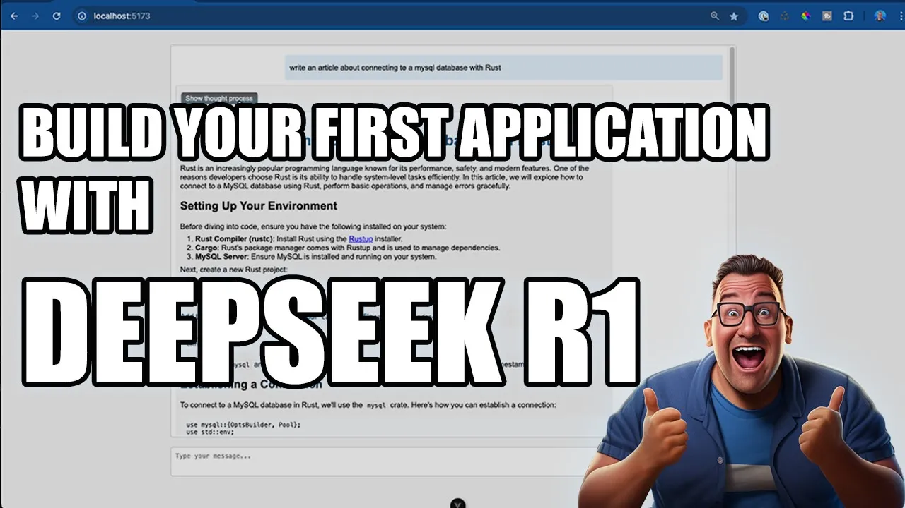

# DeepSeek Chat Demo

A Vue.js-based chat interface demo for interacting with DeepSeek language models.



[Check out the YouTube video building and implementing this project](https://youtu.be/-88H21XLbiI)

## Features

- Real-time chat interface
- Markdown support for messages
- Thought process visibility toggle
- Code syntax highlighting
- Responsive design
- Integration with DeepSeek API

## Prerequisites

- Node.js (v18 or higher)
- npm or pnpm
- DeepSeek API running locally on port 11434

## Installation

1. Clone the repository:

```sh
git clone https://github.com/yourusername/deepseekchat.git
cd deepseekchat
npm install
npm run dev
```

The application will be available at http://localhost:5173

## Building for Production

Build the application:

```
npm run build
```

Or you can run 

```
docker-compose up
```
The Docker image is [also available at Docker Hub](https://hub.docker.com/r/jeremymorgan/deepseek-1-5b-chat-demo/tags)
 
## Testing
Run unit tests:

```sh
npm run test:unit
```

## Scripts
`npm run dev` - Start development server
`npm run build` - Build for production
`npm run preview` - Preview production build
`npm run test:unit` - Run unit tests
`npm run lint` - Lint and fix files
`npm run format` - Format code with Prettier

## Tech Stack
- Vue 3
- TypeScript
- Vite
- Vitest
- Sass
- Marked (for Markdown rendering)
- ESLint + Prettier

## License
CC0 1.0 Universal

## Contributing
Contributions are always welcome. 


